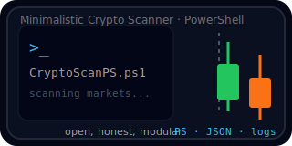

  

<h1 align="center">CryptoScanPS</h1>

  Minimalistic PowerShell tool for scanning the crypto market — part of my personal trading / AI stack.

  
  
  

---

⚡ What It Does

Loads a clean, human-readable config.json

Pulls data from a public exchange endpoint (demo mode)

Filters symbols by volume

Logs every run (because logs = truth)

Outputs clean JSON

Uses modular PowerShell design:

http.psm1 — requests

parser.psm1 — shaping data

utils.psm1 — helpers

No magic. No fragile wrappers. Just a reliable scanner.
